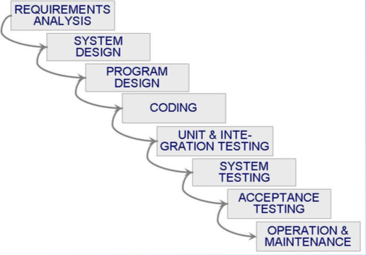

COP4331 Midterm Review
========================================

- Possibly **100** questions *RIP*
    - MCQ
    - Fill in the blank
    - Matching
    - Diagram drawing
    - Requirements writing
    - Worst review ever

**TLDR**
Know everything, this review was absolutely useless

## Chapter 1: What is Software Engineering
- Difference between Analysis/Synthesis
    - Analysis
        - Decompose a large problem into smaller, undestandable pieces
    - Synthesis
        - Build a software from smaller building blocks
- Difference between CS and Software Engineering
    - Computer Science
        - Focusing on computer hardware, compilers, operating systems, 
        and programming languages
    - Software Engineering
        - A discipline that uses computer and software technologies as a problem
        solving tools    
- "Not rocket science, folks"
- Fault vs. Failure
    - Fault
        - Occurs when a human makes a mistake, called an **error**, in performing
        some software activities
    - Failure
        - A departure from the system's required behavior
- Know the different views of quality (transcendental, user, etc.)
    - Transcendental view
        - Quality is something we can recognize but not define
    - User view
        - Quality is fitness for purpose
    - Manufacturing view
        - Quality is conformance to specification, a process view
    - Product view
        - Quality tied to inherent product characteristics, internal view
    - Value-based view
        - Quality depends on the amount the customers is willing to pay for it
- What is good software, three ways to consider quality
    - Quality of the product
    - Quality of the process that results from the software product
    - Quality of the product in the context of the business environment
    where it will be used
- Look at McCall's quality model *Probably not on it*
    - 
- Quality of the process
    - Quality of the development and maintenance process **is as important**
    as the product quality
    - Development process needs to be modeled
    - Modeling addresses questions such as
        - Where to find faults
        - How to find them early
        - Build fault tolerance
        - Alternative activities
- Quality in the context of the business environment
    - Quantify business value
    - ROI (more slides in other chapters)
    - Return on Investment
        - What is given up for other purposes
        - Reduce costs, predict savings, improve productivity
- Who does SWE
    - Not customer, user, etc.
    - Customer is who pays
    - Developer is the person building the software
    - User is who actually uses it
    - Know the differences
- System activities/objectives/boundaries
    - Activity
        - Event initiated by a trigger
- Objects/Entities
    - Elements involved in the activities
- Relationship defines the interaction between objects and activites
- System boundaries determine the origin of input and destinations of the output
- "Lots of basic stuff in the slides on systems"
    - What is a system?
        - A collection of things (*so vague*)
            - Set of entities
            - Set of activities
            - Description of the relationship among the entities/activities
            - A boundary
                - Some items within our system and some cross into another system
- Know layering (systems/architectures)
    - "Maybe next test, forget this..."
    - Some systems are dependent to other systems
- Know engineering approach slide 1.30 (1.6 Engineering Approach)
    - Requirement analysis and definition
    - System design
        - Sounds like use case diagram
    - Program design
        - Sounds like class diagrams
    - Writing the programs
    - Unit testing
        - Testing individual pieces/methods
    - Integration testing
        - Putting system together
    - System testing
        - Testing whole system
    - System delivery
    - Maintenance
- Who is on the development team?
    - Requirement analysts
        - Work with customers to identify and document requirements
    - Designers
        - Generate "system-level" description of what the system is supposed to do        
    - Programmers
        - Write lines of code to implement the design
    - Testers
        - Catch faults
    - Trainers
        - Show users how to use the system
    - Maintenance team
        - Fix faults that show up **later**
    - Librarians
        - Prepare and store documents such as software requirements
    - Configuration management team
        - Maintain correspondence among various artifacts and software releases
- All of the diagrams that deal with developer roles, the steps (1.32)
    - 
- Know a little of Wasserman's seven key factors
    - When is waterfall an appropriate methodoloy to use
        - Static work environment with unchanging requirements
- 1.36 terms
    - Abstractions
        - Level of generalization
    - Analysis and design methods and notations
    - User interface prototyping
    - Etc.
    - Look at all the nitty gritty slides on these terms
- Know prototyping
    - UI
- Software architecture, how it has changed
    - "This hasn't changed as far as I'm concerned"
    - The slide says it has changed though
    - K.
- Different software needs different processes
    - More controlled development process, rapid development for prototype
    - Enterprise system requires more controlled environment
    - Single user app, can be more rapid development
- Software reuse
    - Know what it is
    - Reuse artifacts from previous developments
    - Improve productivity
    - Reduce costs
    - Concerns
        - May be faster to build smaller app than searching for reusable components
        - Reusable stuff takes longer to make
        - Who maintains the components?
        - Generality vs. Specificity: **always a conflict**
- Piccadilly system
    - Know the system
    - TV Programming company with strict requirements on airtime with shows/ads
    - System boundary with inputs and outputs 
    - Things from the chapter relate to stuff in lecture
    - Might want to open the textbook for the first time and read about Piccadilly
- Know the Ariane 5 rocket example
    - Software backup, don't use the same failed reused code

## Chapter 2: Modeling the Process and Life Cycle
- Process, what is it?
    - Series of steps involving activities, constraints, and resources that
    produce an intended output of some kind
    - Set of ordered tasks
    - Involves a set of tools and techniques
    - Involves a set of procedures used to make the final product
- Slide 2.4, why are they important?
    - Improve consistency and structure on a set of activities
    - Guide us to understand, control, examine and improve the activities
    - Capture our experiences and pass them along
- Reasons for modeling a process
    - "I guess thats important"
    - Form common understanding
    - Find inconsistencies, redundancies, omissions
- Software Development Life Cycle
    - SDLC
    - Same process as engineering approach from last chapter
    - Activities done in a life cycle
    - Know the ORDER
- Know the different software developent ideologies 
- Waterfall method
    - Finish one step at a time
    - Works well for problems with minimal/no requirement changes
    - Well understood problems
        - Able to break into sub problems and incremental steps easily
    - Easy to explain to customers
    - Hgih level view of the dev process
    - Know the drawbacks
        - Doesn't handle changes very easily
        - Views software development as manufacturing process
        - Software dev is a creation process
        - No guidance how to handle changes during dev
        - No iteration, because iteration best when problem is not understood well
        - Clients may not know the requirements        
            - They need to know them early in waterfall
        - Long wait before final product
    - Prototyping makes it more useful
    - No iterations in waterfall model
        - Usually in other models there are a lot of other iterations
    - Each major phase is marked by milestones and deliverables
    - 
- V Model
    - Modified waterfall
    - Know something about the V
    - Uses unit testing to verify procedural design
    - Uses integration testing to verify architectural (system) design
    - Uses acceptance testing to validate the requirements
    - If problems found during verify/validate, re-do the left side of V before
    the right side is
    - Drawbacks of V
        - Similar drawbacks to Waterfall
        - Too simple, may not reflect software process accurately
        - Use of inefficient and ineffective testing techniques
        - Rigid link between left and right side
    - 
- Prototyping model
    - **Repeated investigation of requirements or design**
    - Reduce risk and uncertainty in the development as well as time/cost
    - When to use the model
    - What kind of systems
        - Online and HCl
    - Know drawbacks
        - Not sufficient analysys (functionality, scalability, maintainability)
        - User misunderstanding (prototype vs final product)
        - Developer misunderstanding user requirements
        - Too much time spent on prototype dev
            - Money
            - Increases involvement and attachment to prototype
    - 
- Phased development
    - Release first version, implement some requirements, then release part 2
    - Kind of like scrum
    - Incremental and iterative development
        - Difference between the two
        - Iterative
            - Starts with full system, then changes functionality of each
            subsystem with each new release
            - e.g. iPhone
        - Incremental
            - Start small and adds functionality with each new release
        - 
    - Shorter cycle time (time for requirements to delivery)
    - System delivered in pieces
        - Customers have something to use while the rest is being made
    - Two systems functioning in parallel
        - Production system (What's currently being used)
        - Development system (the next version)
    - Supported by US DoD, NASA
    - Desirable because...
        - Markets can be created early for functionality that has never been
        offered
        - Dev team can focus on different areas of expertise with different releases
            - Go from command line to point and click
        - Easier to test and debug because done in increments
        - Regression testing after each iteration
    - 
- "Not rocket science folks"
- Spiral model
    - Start in the center and spiral to the outside
    - The model has 4 aspects to it, look at the crazy spiral diagram
    - Dont need to know details of spiral?
    - 
- Agile methods
    - Know lots about these guys
    - Agile manifesto
        - Know a bit about it
    - Extreme programming
    - Edwin is trying to destroy the class harder at this point in class
    - Crystal, Scrum, etc.
    - Maybe list a few of Agile methodologies on test
    - There are slides with details on them all
    - Know the characteristics, not by heart, but know them
        - WTF does that mean?
    - Know something about Scrum
- Process modeling
    - Static vs. Dynamic model
- "You better know these diagram techniques"
    - Lai Notation example
        - "Lay notation? Idk what it is"
    - Transition diagram
    - Just know the static vs dynamic
    - Too many stupid diagrams accroding to Edwin
    - Oh wait they're important now accroding to Edwin
        - Know the difference between static and dynamic diagrams
    
## Chapter 3
- Project schedule
- Understand the customer's needs
- Project schedule diagrams (PERT diagrams maybe will come)
- Building a house example, maybe that will be useful for this, no idea
- Activity graph
- "We went over this extensively in class"
    - Did we though?
- Critical path method
    - related with Slack, how?
- At this point Edwin is just saying what we talked about in class and not what to study
- Lay out activities in parallel
- Gantt chart
    - "Pretty important"
- Critical path is the longest path
    - Don't understand that, you don't understand critical path
- Project personnel section "is not testable material in my opinion"
- Forget work styles stuff
    - Social science
    - "Dr. Tomato"
- Edwin is instigating issues with groups now trying to start fights
- Cost estimation
- Estimation should be done repeatedly
    - Know the chart
    - He might ask a question about it
    - So glad I have to learn a dumb chart to MAYBE get a question on it
- Forget about the math formulas
- Two factors that affect difficulty
    - New or old problem
    - Easy or moderate fix
    - N, O, E, M prefixes in the table
- Baily Basily or something in the title
- COCOMO II
    - What is the model
    - High level overview
- Complexity points for application points
    - Know what it is I guess
- Case base reasoning
    - T/F question about CBR and what it does
- MMRE
    - Mean magnitude of relative error
    - How does it work? Matching question on different estimating techniques
    - Why so many question types?
- Evaluating models
    - Dont know how to apply them, but know what the models are and what they do, there are a ton
- Effort distribution charts
- "Something about Risk" (3.4)
    - Risk impact
    - Risk probability
    - Go through the digram (3.64 slide)
    - "Risk is important"
        - Exposure
        - Remediation
- Know what was in the PMP
- Project Plan stuff
- Different organizations
    - Matrix organization
    - IPD
- Piccadilly again
    - Review all of Piccadilly stuff in the book

## Chapter 4
- Requirements process
- Know what a **requirement** is
- Why are requirements important? Why do projects tend to fail?
- Know the chart on slide 4.6 inside and out
- Why go to Agile methods? because requirements are uncertain
- Review page 150 of the textbook
    - He definitely didn't write that by the way
    - Probably doesn't even know what that page is
- Know what fit criteria is
- Prioritize requirements
    - Slide 4.15
- Requirements definition and specification
- Chart on 4.17, ask you a question about whats on the chart, understand it for some stupid reason
    - He's reasoning with himself on what he can ask us on the test, wow
- Traceability of requirements
    - And testability
- Modeling notions
- ER diagrams
    - Entity relation attributes
    - Tell what diagram it is
    - Label it, so know what an ER diagram looks like
    - Edwin doesn't know what we do in class or lab btw
- Know UML class diagrams too
- Know what Event Traces are
    - Used for, what are they representing, etc.
    - Matching question with what ET is used for?
- Message sequence chart
    - Apparently we did it in class
- State machines
    - Finite state machines, coin machine example
- Put diagram and say what's happening
- UML state chart
    - What its use is
- Know the difference in ways of thinking about state
- Petri Nets
    - Won't be asked too much about these
- Data flow diagrams are important, know something about that
    - Advantages/Disadvantages
- System boundary is back
- Use cases know inside and out
    - "Doubt I'll make you do a diagram, but I might"
- Decision table is and how it might be used, why useful
- Algebraic specification, etc.
    - Know their names?
- "Know quite a bit about UML"
    - Literally no more detail than this, the whole review ^
- SDL
    - Used by EU mainly
- Basic of prototyping again, there's an example
    - Second example is best
- Throwaway or evolutionary approach
- "Boy this is a big chapter"
    - ...
- Validation and verification
- Chart on 4.87
    - Know the basics of what normally occurs and when it occurs?
- Measuring requirements? How to measure them?
- Piccadilly system
- Chapter 4 is the most important one apparently
- But we barely did any of it